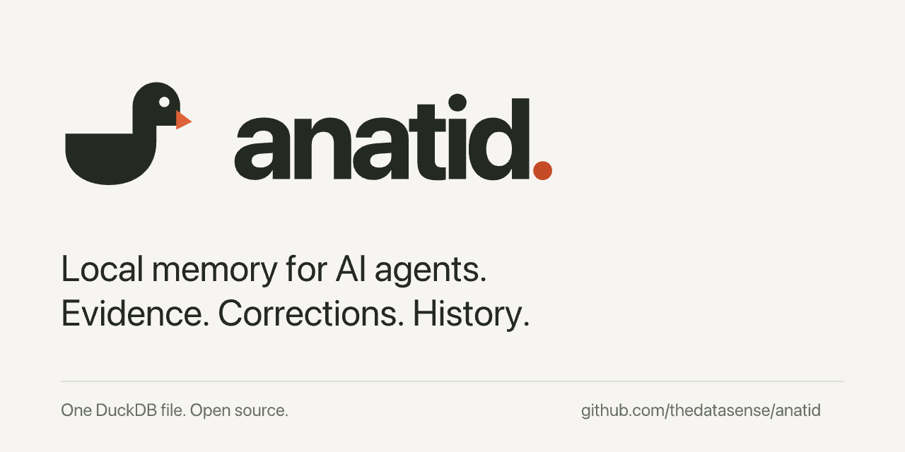

[Documentation](README.md) · [Examples](../examples/README.md)

# Brand assets

The anatid mark pairs a duck with the lowercase **anatid.** wordmark. Keep the duck, lettering,
orange beak, and orange period together when space allows. The shared assets live in
[`assets/brand`](../assets/brand); use those files instead of recreating the mark with text or CSS.
The SVG lettering is outlined, so no font installation or download is required.

| Asset | Use |
| --- | --- |
| [Logo SVG](../assets/brand/anatid-logo.svg) | Scalable, transparent logo on light backgrounds |
| [Logo PNG](../assets/brand/anatid-logo.png) | 1120 × 384, paper background; README, PyPI, and documentation |
| [Light logo SVG](../assets/brand/anatid-logo-dark.svg) | Transparent logo for dark backgrounds |
| [Duck SVG](../assets/brand/anatid-icon.svg) / [PNG](../assets/brand/anatid-icon.png) | Square application or registry icon; PNG is 512 × 512 |
| [Favicon SVG](../assets/brand/favicon.svg) / [ICO](../assets/brand/favicon.ico) | Browser tabs; ICO includes 16, 32, 48, and 64 pixel sizes |
| [Sharing card PNG](../assets/brand/social-preview.png) / [SVG source](../assets/brand/social-preview.svg) | 1280 × 640 repository and social preview |

## Colors and spacing

| Color | Value | Role |
| --- | --- | --- |
| Ink | `#242922` | Duck and lettering |
| Paper | `#f6f5f1` | Background and eye |
| Burnt orange | `#c44b25` | Wordmark period |
| Beak orange | `#de6137` | Beak; accent on dark backgrounds |

Preserve the aspect ratio and the padding built into the files. Use the full logo at 140 pixels
wide or larger; use the square duck when space is tighter. Don't stretch, crop, add effects, or
retype the wordmark. Refer to the package as `anatid` in prose and commands; the orange period
belongs to the graphic.

## Where it appears

The root README uses an absolute HTTPS PNG URL so the same image renders on GitHub and PyPI.
PyPI gets its description from the README in each published distribution; changing the local
README requires a new release before the package page updates. The project metadata links to
the documentation and release history.

Documentation pages use the same PNG. Both local studios serve the shared SVG and favicon;
Procedural Studio embeds both as data URLs in standalone exports.
The source distribution includes
the docs, examples, and brand assets. The MCP Registry manifest references the square PNG.

GitHub's repository sharing image is a separate setting; committing a PNG does not activate it.
In [repository settings](https://github.com/thedatasense/anatid/settings), under **Social preview**,
choose **Edit → Upload an image** and select `assets/brand/social-preview.png`.
The card meets GitHub's [recommended dimensions and size limit](https://docs.github.com/en/repositories/managing-your-repositorys-settings-and-features/customizing-your-repository/customizing-your-repositorys-social-media-preview).

