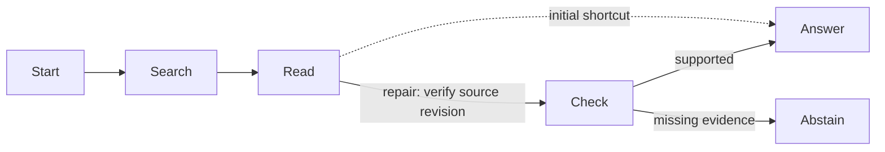

# Procedural graphs: memory for what to do next

[Lu et al., *Procedural Graphs: Self-Evolving Execution Structures for LLM Agents*](https://arxiv.org/abs/2609.09153v1)
describe directed procedure transitions with `condition`, `guidance`, and `pitfalls` attributes.
At each step, the last action identifies an active node. A guidance model reads its outgoing
two-hop neighborhood and advises the solver. Offline, a refiner proposes changes from execution
traces; validation decides whether to retain them. Sections 3.1–3.3 describe these mechanics.

Anatid can supply the persistent, auditable memory underneath this loop. The runnable
[`examples/procedural_graph.py`](../examples/procedural_graph.py) demonstrates that mapping using
existing tables and verbs. It adds no dependency or schema migration.

## Run the demonstration

```bash
python examples/procedural_graph.py
# Optionally keep the data for SQL inspection; the path must not exist:
python examples/procedural_graph.py --db /tmp/procedures.anatid
```

The synthetic task asks for an owner from retrieved source notes. Search sometimes returns an
old note first. The initial procedure says to answer from the first passage; the repaired
procedure adds a verification step that selects the newest revision and cites its source.
Missing evidence leads to abstention.



The actual offline output includes:

```text
Flawed prior: start -> search -> read -> answer; answer=Bo; pass=False
Repair validation: 1/4 -> 4/4; accepted=True
initial graph: 1/4 passed
repaired graph: 4/4 passed
Repaired trace: start -> search -> read -> check -> answer; answer=Cy; source=note-c
Proposed shortcut: 4/4 -> 1/4; accepted=False
Historical replay: start -> search -> read -> answer
Repair provenance: 2 linked memories; evidence includes validation traces.
```

These are fixture scores from a **scripted solver and scripted proposals**, not measured LLM
accuracy gains. Training, validation, and final test fixtures have separate source records, but
cover the same deliberately small set of failure patterns. They establish the mechanics, not
generalization. The simulator chooses transitions deterministically and recognizes three
condition labels; it does not perform the paper's generative guidance or autonomous refinement.

## How it maps to Anatid

| Paper concept | Example representation | Existing capability |
| --- | --- | --- |
| Procedure node | Graph-qualified entity, e.g. `evidence_qa/check` | `remember(..., entity_kind="procedure")` |
| Directed transition | `edges_relates.src` and `.dst`, with a unique rule label | `relate()` |
| Relation and textual attributes | JSON memory, ABOUT both endpoint entities | `remember()`, `context()` |
| Runbook or execution evidence | Raw episode attached to a transition or evolution decision | `episode`, `provenance()` |
| Frozen online graph | Immutable `Graph` loaded before a rollout | One scoped SQL snapshot |
| Connected guidance | Outgoing breadth-first expansion with hop labels and attributes | Small example adapter |
| Accepted edit | Supersede attributes and move the edge together | `correct()` inside `transaction()` |
| Rejected edit | Proposal, training traces and validation results retained as memory | `remember(kind="procedure_rejected:...")` |
| Historical procedure | Both time predicates applied to memories, edges and entities | `Visibility.at(..., as_of)` |

The key distinction is direction. `recall_2hop()` intentionally traverses relations in both
directions and returns memories, not ordered transitions. Changing that behavior would break
factual recall. The example instead reads procedure edges and their linked attributes with
tenant and temporal predicates, then expands outgoing edges only. It loads the small graph
once per rollout; it does not claim indexed subgraph retrieval at scale.

`edges_relates` has no arbitrary attribute payload today. Storing attributes as a memory gives
them evidence and supersession history immediately. The edge's internal `rel_kind` identifies
the rule uniquely; its semantic relation, such as `REQUIRES`, lives in the JSON. Unique labels
also prevent `unrelate()`'s bidirectional close from accidentally removing a different reverse
transition. The read checks that the memory's endpoints agree with the stored edge direction.

## What makes the demonstration useful

1. **Preserving prerequisites.** The same database runs BM25 for “submit final answer.” Its top
   two hits omit `read → check`. The outgoing neighborhood from `read` includes that prerequisite
   and the next branches. This is a concrete counterexample to a connectivity guarantee, not an
   accuracy comparison against a tuned retrieval baseline.
2. **Improving behavior without changing the solver.** The exact same simulator and tools run
   before and after a stored procedure edit. Only the graph changes. Verification is an existing
   mock tool; the demonstration does not learn a new verification algorithm.
3. **Keeping bad revisions out.** A later proposal bypasses verification again. Validation
   rejects it and stores the failure traces. The retained graph stays intact. Equal validation
   scores are accepted, following the paper's gate.
4. **Explaining why behavior changed.** `provenance()` connects the new rule to its original
   runbook and the validation evidence. A historical snapshot replays the old route even after
   the correction. An in-flight immutable snapshot also keeps its original procedure.

Candidate graphs are checked before evaluation. Duplicate keys, empty fields, terminal nodes
with outgoing edges, and reachable nodes with no path to a terminal are invalid. Recovery
cycles are allowed; the simulator has a step budget. This is not a general graph validator.

## Moving from the example to a real agent

Keep this adapter in examples until the execution contract is exercised with a real solver.
The next integration should take a frozen checkpoint and the actual last tool name, then pass
`graph.guidance(last_action)` plus the query and a recent action/observation window to a guidance
model. Supply its advice to the solver before the next action. Unknown action names use the
full-graph fallback; terminal nodes have no outgoing guidance. Keep textual conditions as
model input: do not evaluate them as Python, SQL, or shell code.

The paper uses soft advice: the solver remains free to choose. The scripted rollout here is
a test double that follows edges, so it must be replaced for an LLM evaluation. Store actual
tool observations and scores as episodes. A refiner should receive successful and failed
training traces **and retained rejection memories**, propose typed edits to a copy, and evaluate
them on validation tasks. This example records rejection memory but has no model that consumes it.

For real model calls, evaluate outside the database transaction and compare the retained
checkpoint version before committing. The demo's cheap, local evaluation holds a transaction
across the read and commit. Add a version conflict/retry contract before allowing concurrent
refiners. Candidate addition, deletion, attribute edits, action-name mapping, and bounded
directed retrieval should then become a dedicated `anatid.procedures` API with server/MCP
support if the experiment warrants it.

To show real power, run the same solver, tools, task splits, and budgets with: no procedural
memory; flat retrieved rules; the full graph; local two-hop guidance; and an evolved graph.
Reserve final test tasks from refinement and validation. Report task success, skipped
prerequisites, repeated calls, context tokens, end-to-end latency, and total model cost including
guidance and refinement. Repeat stochastic runs and report uncertainty. A useful Anatid-specific
demonstration should also show the exact revision and source evidence behind each changed action.
